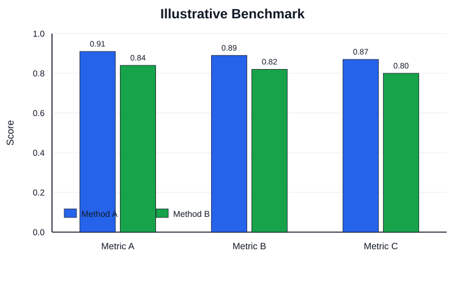
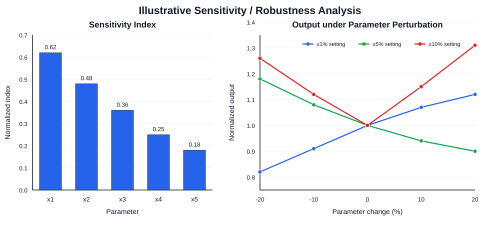

# Engineering Figure GPT

<div align="center">


**GPT-native research-figure production for engineering, AI, data science, electronics, and mathematical modeling.**

Conceptual figures use GPT image generation with explicit publication-quality contracts. Existing figures can be corrected/revised/restyled/redrawn with preservation rules. Exact quantitative figures stay local and deterministic.

[中文说明](README.zh-CN.md) · [English Guide](README.en.md) · [Showcase](docs/showcase.md) · [Install](INSTALL.md)

</div>

## Reproducible outputs + conceptual preview

| Exact benchmark output | Sensitivity / robustness output |
|---|---|
|  |  |
| [brief](docs/examples/benchmark-exact/brief.md) · [request](docs/examples/benchmark-exact/request.json) · [spec](docs/examples/benchmark-exact/plot-spec.json) · [verification](docs/examples/benchmark-exact/verification.md) | [brief](docs/examples/sensitivity-robustness/brief.md) · [request](docs/examples/sensitivity-robustness/request.json) · [spec](docs/examples/sensitivity-robustness/plot-spec.json) · [verification](docs/examples/sensitivity-robustness/verification.md) |

Both datasets are intentionally **synthetic/illustrative**. They demonstrate the exact Plot Mode evidence chain and are not scientific claims.

Conceptual SVGs under `docs/showcase/` are still **layout previews**, not claims that GPT generated them. A conceptual case only becomes a real showcase example after its actual `brief + prompt + output + verification` chain is committed.

## Why this skill exists

Research figures are not one-prompt problems.

| Figure need | Better path |
|---|---|
| New architecture, workflow, graphical abstract, modeling framework | `image` |
| Fix / revise / restyle / redraw an existing figure | `edit` |
| Benchmark bars, trends, heatmaps, scatter, sensitivity/robustness | `plot` |
| Conceptual + quantitative panels | `mixed` |
| Exact formulas or measured geometry | deterministic/editable handoff |

Core rule: **numeric truth overrides aesthetics**. Exact values, axes, uncertainty, benchmark geometry, and long formulas should not be redrawn by an image model.

## Image Pipeline v2: content constraints + quality constraints

A domain prompt should not carry every visual rule by itself. Engineering Figure GPT composes conceptual prompts from separate layers:

```text
domain/content template
        +
publication image-quality contract
        +
user style note
        +
edit preservation contract (when editing)
        +
optional spatial mask constraint (localized edits)
```

The reusable quality contracts live in:

```text
assets/prompt-templates/image-quality-contracts.json
```

Profiles:

- `draft`: structural exploration
- `paper`: default paper-ready constraints
- `final`: strongest final-export constraints

Default rendering hints when no explicit runtime override is supplied:

- `draft` → `quality=low`, `size=1024x1024`
- `paper` → `quality=high`, `size=1536x1024`
- `final` quality profile → `quality=high`, `size=2048x1152`

The `paper`/`final` contracts explicitly constrain:

- safe outer margins and no clipping
- clean reading direction
- large readable label regions
- strong text/background contrast
- no unreadable micro-text
- essential labels readable around 50% native scale / paper width
- crisp arrows, borders, and arrowheads
- stable alignment and spacing
- restrained semantic colors
- no blur/ghosting or decorative pseudo-technical fine print
- no unrelated content invention

See [Image Quality Contract](references/image-quality-contract.md), [Publication Figure Design](references/publication-figure-design.md), and [Visual QA](references/visual-qa.md).

## Image mode — generate a new conceptual figure

Inside Codex, use the installed GPT image path when appropriate. For reproducibility or command-line use, the unified CLI injects the selected quality contract before the image request.

```bash
python scripts/efg.py image \
  "A retrieval system with OCR, embeddings, reranking, and answer synthesis" \
  --figure-template system-architecture \
  --quality-profile paper \
  --lang en \
  --save-prompt output/final-prompt.txt \
  --dry-run
```

Remove `--dry-run` only when a live request is intended.

Even raw image requests without `--figure-template` receive the selected quality contract when routed through `efg image`.

## Edit mode — modify an existing figure without casually redrawing everything

Image editing is a first-class workflow rather than a hidden `--input-image` flag.

```bash
python scripts/efg.py edit figure.png \
  "Change Encoder to Cross-Attention Encoder only" \
  --mode correct \
  --preserve "all arrow endpoints" \
  --save-prompt output/edit-prompt.txt \
  --dry-run
```

Four modes define how much change is allowed:

| Mode | Intended behavior |
|---|---|
| `correct` | smallest possible local fix; preserve everything unrelated |
| `revise` | requested local content/structure change; keep unaffected content stable |
| `restyle` | change visual style only; lock scientific content and relationships |
| `redraw` | reconstruct cleanly while preserving scientific meaning and canonical labels |

Use repeatable controls when the boundary matters:

```bash
--preserve "module positions"
--preserve "all labels except the requested one"
--allow-change "the Encoder label text"
```

Additional visual references can be passed with `--reference-image`. The primary input image remains the scientific/content baseline.

### Mask-guided localized correction

For a local typo, wrong label, arrow region, or another bounded defect, add a spatial mask on top of the semantic preservation contract:

```bash
python scripts/efg.py edit figure.png \
  "Fix only the mislabeled module" \
  --mode correct \
  --mask edit-mask.png \
  --preserve "all arrows and unaffected labels"
```

Before upload, the portable path checks that the mask is smaller than 50 MB, matches the primary figure's dimensions and image format exactly, and contains an alpha channel. The resolved edit prompt also preserves content outside the mask except minimal blending at the boundary.

A mask is **strong spatial guidance, not a pixel-perfect guarantee**. The result still has to pass source-vs-result Visual QA; an unrelated change outside the intended region is a failed `correct` edit.

### GPT Image 2 editing behavior

For `gpt-image-2`, **do not pass `input_fidelity`**. GPT Image 2 always processes image inputs at high fidelity and the API does not allow changing that setting.

If `--size` is omitted for an edit, the CLI inspects the primary source image:

- legal GPT Image 2 source dimensions → preserve the exact canvas;
- unsupported pixel dimensions but supported aspect ratio → use the nearest legal canvas and print a warning;
- unsafe/unresolvable canvas → fail or require an explicit legal `--size` instead of silently changing the figure.

This is especially important for `correct`: fixing one label should not unexpectedly convert the figure to a different aspect ratio.

See [Edit Mode](references/edit-mode.md).

## Visual QA — API success is not figure success

Before final paper use, inspect conceptual images in this order:

1. scientific fidelity
2. text integrity
3. layout integrity
4. arrows and line quality
5. color/contrast
6. raster clarity at native and approximately 50% scale
7. source-vs-edit preservation when editing, including unintended changes outside a mask

Use localized correction instead of full regeneration when only one region is wrong:

```text
typo / wrong arrow / minor clipping -> edit --mode correct
content change                       -> edit --mode revise
style-only problem                   -> edit --mode restyle
globally unusable draft              -> edit --mode redraw or regenerate
```

See [Visual QA](references/visual-qa.md).

## Final/high-resolution: model tier is not pixel size

Routine image generation uses `OPENAI_IMAGE_MODEL` and otherwise defaults to `gpt-image-2`.

Final-model routing uses `OPENAI_IMAGE_HIGHRES_MODEL` or an explicit image `--model`:

```bash
python scripts/efg.py image \
  "technical background" \
  --figure-template graphical-abstract \
  --final
```

If `--final` / `--highres` has no configured final model, the CLI stops instead of silently downgrading.

A high-resolution model name does **not** prove the returned raster dimensions. For GPT Image 2, concrete output sizes must satisfy its model constraints: both edges divisible by 16, maximum edge 3840 px, long/short ratio at most 3:1, and total pixels between 655,360 and 8,294,400.

The returned file can be checked objectively:

```bash
python scripts/efg.py verify-image output/figure.png \
  --expected-size 1536x1024 \
  --require-format png
```

Minimum-size gate:

```bash
python scripts/efg.py verify-image output/figure.png \
  --min-width 1500 \
  --min-height 1000 \
  --min-megapixels 1.5
```

Never claim 2K/4K/final-size output solely because a model name contains `final`, `pro`, or `highres`. If the provider returns the wrong raster size, report the mismatch rather than silently accepting it.

See [Final / High-Resolution Policy](references/highres-policy.md).

## Codex CLI + CC Switch provider reuse

For command-line Codex users, the portable GPT image path can reuse the active provider from:

```text
~/.codex/config.toml
~/.codex/auth.json
```

Resolution order:

```text
explicit CLI override
        ↓
active Codex / CC Switch provider
        ↓
legacy OPENAI_* environment fallback
        ↓
official OpenAI default
```

Inspect the active provider without printing secrets:

```bash
python scripts/codex_provider_config.py
```

Probe image route compatibility before spending image credits:

```bash
python scripts/efg.py provider-check
```

A non-OpenAI endpoint already selected in active Codex configuration is treated as user-selected. A manually supplied relay still requires explicit trust:

```bash
python scripts/efg.py image \
  "technical background" \
  --figure-template system-architecture \
  --base-url https://relay.example/v1 \
  --allow-third-party
```

Provider checks can confirm basic route/model exposure but cannot guarantee that every relay implements every size/quality/edit parameter identically. Verify the actual artifact when the output contract matters.

## Plot mode

Natural language is the user interface; JSON is internal execution data.

Supported panel intents include grouped bars, error bars, trend curves, uncertainty shadows, heatmaps, scatter plots, legend-only panels, and multi-panel layouts.

Internal pipeline:

```text
concise Plot Request (`kind`)
        ↓
build_plot_spec.py
        ↓
normalized Plot Spec (`type`)
        ↓
plot_publication_figure.py
```

One-command route:

```bash
python scripts/efg.py plot examples/multi-panel-plot-request.json \
  --spec-out output/spec.json \
  --out-path output/figure \
  --formats png pdf svg
```

If a normalized spec already exists:

```bash
python scripts/efg.py render output/spec.json --out-path output/figure --formats png pdf svg
```

See [Publication Plot API](references/publication-plot-api.md) and [Chart Patterns](references/publication-chart-patterns.md).

## Mixed mode

Render exact quantitative panels locally first. Generate conceptual panels separately. Compose them afterward and never ask the image model to redraw exact plots.

See [Editable Figure Handoff](references/editable-figure-handoff.md).

## Mathematical modeling is a dedicated domain pack

Prompt packs:

```text
assets/prompt-templates/engineering-figure-templates.json
assets/prompt-templates/mathematical-modeling-templates.json
```

The mathematical-modeling pack adds dedicated templates for:

- problem analysis
- Q1/Q2/Q3 dependency
- data preprocessing
- forecasting
- classification
- clustering
- optimization formulation
- multi-objective / Pareto workflow
- spatial modeling
- network modeling
- evaluation systems
- sensitivity analysis
- robustness analysis
- decision frameworks
- full end-to-end modeling pipelines

List all available templates:

```bash
python scripts/build_engineering_figure_prompt.py --list-templates
```

Chinese and bilingual academic labels are first-class workflows. Exact forecast curves, Pareto fronts, sensitivity indices, robustness curves, confusion matrices, and benchmark values remain local/deterministic.

## Install for Codex

Recommended Windows source install:

```powershell
git clone https://github.com/xiaohan-2005/engineering-figure-gpt.git "$HOME/engineering-figure-gpt"
& "$HOME/engineering-figure-gpt/scripts/install_and_test.ps1"
```

The installer syncs a **pruned execution runtime** to:

```text
~/.codex/skills/engineering-figure-gpt
```

The installed Runtime intentionally contains the execution Skill, prompt assets, core references, and executable Python scripts. Repository-only docs, tests, CI validators, installer diagnostics, and the interactive setup helper remain in the source checkout so they do not inflate the Codex Runtime context budget.

The default installer performs offline E2E checks for:

```text
Plot Request -> Spec -> Renderer -> PNG
Edit Contract -> preservation-first dry-run prompt
Raster Fixture -> verify-image size/format gate
```

These use no image API credits.

Optional paid live image smoke test:

```powershell
& "$HOME/engineering-figure-gpt/scripts/install_and_test.ps1" -TestLiveImage
```

The live smoke test routes through `efg image`, requests a concrete raster size, then verifies the returned PNG dimensions.

Setup diagnostics use the source helper while inspecting the installed Runtime:

```powershell
& "$HOME/engineering-figure-gpt/scripts/check_setup.ps1" `
  -SkillDir "$HOME/.codex/skills/engineering-figure-gpt"
```

Interactive wizard also runs from the source checkout but targets the installed Runtime:

```powershell
& "$HOME/engineering-figure-gpt/scripts/wizard.ps1" `
  -SkillDir "$HOME/.codex/skills/engineering-figure-gpt"
```

The wizard covers prompt building, image generation, preservation-first editing (including optional spatial masks), raster verification, provider checking, exact plots, and offline runtime checks. It reuses active Codex / CC Switch provider configuration by default.

## Relay configuration

Manual fallback/override example:

```powershell
$env:OPENAI_BASE_URL = "https://relay.example/v1"
$env:OPENAI_ALLOW_THIRD_PARTY = "1"
$env:OPENAI_IMAGE_MODEL = "gpt-image-2"
$env:OPENAI_API_KEY_FILE = "$HOME/.codex/secrets/openai_api_key.txt"
```

Optional final-quality image model exposed by that provider:

```powershell
$env:OPENAI_IMAGE_HIGHRES_MODEL = "<provider-final-image-model>"
```

Do not invent a model alias that the provider does not expose.

## Unified CLI

```bash
# prompt only + paper quality contract
python scripts/efg.py prompt --figure-template problem-analysis --quality-profile paper --lang zh "建模背景"

# conceptual generation dry-run
python scripts/efg.py image "建模背景" --figure-template full-modeling-pipeline --lang zh --dry-run

# localized image correction dry-run
python scripts/efg.py edit figure.png "只修正第二个模块的错别字" --mode correct --dry-run

# mask-guided localized correction dry-run
python scripts/efg.py edit figure.png "只修改掩膜区域" --mode correct --mask edit-mask.png --dry-run

# explicit raster verification
python scripts/efg.py verify-image output/figure.png --expected-size 1536x1024 --require-format png

# provider compatibility without image generation
python scripts/efg.py provider-check

# request -> normalized spec -> exact figure
python scripts/efg.py plot request.json --spec-out output/spec.json --out-path output/figure --formats png pdf svg

# normalized spec -> exact figure
python scripts/efg.py render output/spec.json --out-path output/figure --formats png pdf svg

# offline runtime smoke checks
python scripts/efg.py check
```

## Reproducibility contract

Conceptual example:

```text
Figure Brief
-> Domain Prompt
-> Quality Contract
-> Real GPT Output
-> Visual QA
-> optional constrained Edit
-> Verification
```

Quantitative example:

```text
Plot Request -> Normalized Plot Spec -> Renderer -> Real Output -> Verification
```

For final paper workflows, add an editable handoff note where labels/formulas/composition may need a deterministic human-editable pass.

See [Reproducibility Chain](references/reproducibility-chain.md) and [Reproducible Examples](docs/examples/README.md).

## Validation

CI checks include:

- Python compilation
- `SKILL.md` package validation
- UTF-8 / common Chinese mojibake regressions
- engineering + mathematical-modeling prompt packs
- injected image-quality contracts
- preservation-first edit prompt behavior
- mask validation and mask multipart edit construction
- GPT Image 2 model-specific size/fidelity safety
- objective raster-size/format verification
- local Markdown links and image paths
- Figure Brief schema behavior
- Plot Request → normalized Plot Spec contracts
- completed showcase manifest/artifact resolution
- image generation/edit request construction
- active Codex/CC Switch provider resolution plus explicit trusted-relay override
- malformed base URL and embedded-credential rejection
- final/high-resolution fail-closed model routing
- HTTP error, timeout, malformed-response, and empty-output failure paths
- real local plot rendering smoke tests
- pruned runtime context/byte budgets
- offline CLI smoke checks

## Repository map

| Path | Purpose |
|---|---|
| `SKILL.md` | Codex routing, quality, editing, verification, and plotting workflow |
| `assets/prompt-templates/` | engineering/modeling templates + reusable image quality contracts |
| `references/` | quality, edit, visual QA, plotting, Chinese, modeling, relay, final-quality, reproducibility, handoff guidance |
| `scripts/efg.py` | unified user-facing CLI |
| `scripts/image_model_policy.py` | shared GPT Image 2 fidelity/size/canvas/mask policy |
| `scripts/build_image_edit_prompt.py` | preservation-first edit prompt builder |
| `scripts/verify_image_output.py` | objective raster dimension/format/aspect verifier |
| `scripts/generate_image.py` | GPT Image-compatible official/CC Switch/relay fallback |
| `scripts/build_plot_spec.py` | concise request → normalized exact-plot spec |
| `scripts/plot_publication_figure.py` | multi-panel deterministic renderer |
| `scripts/sync_codex_skill.py` | pruned runtime sync |
| `scripts/check_setup.ps1` | source-side Windows/Codex diagnostics for the installed Runtime |
| `scripts/wizard.ps1` | source-side guided workflow targeting the installed Runtime |
| `schemas/` | Figure Brief, Plot Request, normalized Plot Spec contracts |
| `examples/` | reusable plot/brief inputs |
| `docs/examples/` | completed reproducible showcase evidence |
| `tests/` | offline unit, contract, safety, and E2E tests |

## Showcase status

**Exact Plot Mode has real reproducible showcase evidence.** Real GPT conceptual showcase cases should be added only after the quality/edit/verification pipeline is stable and each example preserves a real `brief + resolved prompt + output + visual verification` chain.

## What it is not

- not a full paper-writing system
- not permission to fabricate missing numeric data
- not a guarantee that a model called `highres` returned a particular pixel size
- not a guarantee that a spatial mask is a pixel-perfect edit boundary
- not a guarantee that every third-party relay implements every OpenAI image parameter identically
- not a replacement for visual inspection of generated labels, arrows, clarity, and scientific fidelity
- not a workflow that regenerates an entire figure every time one label is wrong

## License

MIT.
