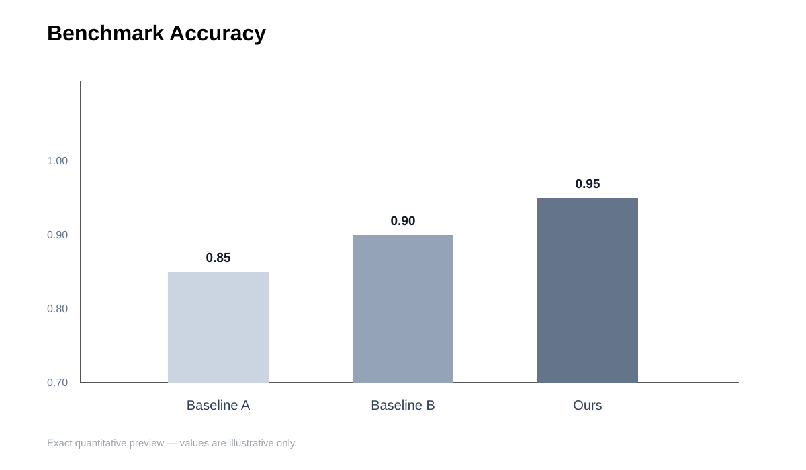

# Engineering Figure GPT

<div align="center">


**GPT-native research-figure production for engineering, AI, data science, and mathematical modeling.**

Conceptual figures use GPT image generation. Exact quantitative figures stay local and deterministic.

[中文说明](README.zh-CN.md) · [English Guide](README.en.md) · [Showcase](docs/showcase.md) · [Install](INSTALL.md)

</div>

## Preview

| Modeling framework preview | Exact-plot layout preview |
|---|---|
|  |  |

The conceptual SVGs currently committed to the repository are **layout previews**, not claims that a GPT run generated them. Real generated outputs should always be paired with their prompt/brief before being presented as reproducible showcase evidence.

## Why this skill exists

Research figures are not one prompt problem.

| Figure need | Better path |
|---|---|
| Architecture, workflow, graphical abstract, modeling framework | `image` mode |
| Benchmark bars, trends, heatmaps, scatter plots, uncertainty | `plot` mode |
| Conceptual + quantitative panels | `mixed` mode |
| Exact formulas or measured geometry | local rendering / later composition |

Core rule: **numeric truth overrides aesthetics**. Exact values, axes, error bars, benchmark geometry, and long formulas should not be redrawn by an image model.

## Three modes

### Image mode

Use GPT image generation for conceptual composition, redraws, and image edits.

Inside Codex, prefer the installed built-in image-generation path. For reproducibility or environments without that path, the repository includes a GPT Image-compatible CLI fallback:

```bash
python scripts/generate_image.py "A publication-quality system architecture ..." --dry-run
```

The CLI defaults to `gpt-image-2` and official OpenAI. It also supports a custom OpenAI-compatible relay/base URL, but a non-OpenAI endpoint must be explicitly trusted so a key or uploaded edit image is never silently sent to an unexpected host.

Official OpenAI:

```bash
python scripts/generate_image.py "research figure prompt" --quality high
```

Trusted relay with environment variables:

```bash
OPENAI_BASE_URL=https://relay.example/v1 \
OPENAI_ALLOW_THIRD_PARTY=1 \
python scripts/generate_image.py "research figure prompt"
```

Trusted relay with CLI flags:

```bash
python scripts/generate_image.py "research figure prompt" \
  --base-url https://relay.example/v1 \
  --allow-third-party
```

The fallback never silently switches provider, model, quality, or size after a failure.

### Plot mode

Natural language is the user interface; JSON is an internal execution format.

Supported panel intents:

- grouped bars, optional error bars and value annotations
- trend curves with uncertainty shadows
- heatmaps with exact matrices
- single- or multi-series scatter plots
- legend-only and empty layout panels
- multi-panel layouts with width/height ratios

The Plot Mode has two explicit contracts:

```text
concise plot request (`kind`)
        ↓
  build_plot_spec.py
        ↓
normalized renderer spec (`type`)
        ↓
plot_publication_figure.py
```

Typical path:

```bash
python scripts/build_plot_spec.py examples/multi-panel-plot-request.json --out output/spec.json
python scripts/plot_publication_figure.py output/spec.json --out-path output/figure --formats png pdf svg
```

### Mixed mode

Render quantitative panels locally first. Generate only the conceptual panels. Never ask the image model to redraw exact plots.

## Mathematical modeling is first-class

The skill explicitly supports:

- problem-analysis maps
- Q1 / Q2 / Q3 dependency frameworks
- data-preprocessing pipelines
- forecasting workflows
- optimization workflows
- sensitivity / robustness analysis
- evaluation frameworks
- decision frameworks

Chinese and bilingual academic labels are also treated as a first-class workflow rather than an afterthought.

## Included conceptual templates

`system-architecture` · `algorithm-workflow` · `graphical-abstract` · `mathematical-model-framework` · `data-analysis-pipeline` · `optimization-workflow` · `evaluation-framework` · `electronic-schematic`

## Install for Codex

Recommended development/source install:

```powershell
git clone https://github.com/xiaohan-2005/engineering-figure-gpt.git "$HOME/engineering-figure-gpt"
& "$HOME/engineering-figure-gpt/scripts/install_and_test.ps1"
```

The installer syncs a **pruned runtime package** to:

```text
~/.codex/skills/engineering-figure-gpt
```

Repository-only files such as docs, examples, tests, and CI configuration are not copied into the Codex runtime.

The default installer test performs a real local Plot Mode E2E chain:

```text
request → normalized spec → renderer → non-empty PNG
```

This is local and has no API cost. A real GPT image request is separate and opt-in with `-TestLiveImage`.

Setup diagnostics:

```powershell
& "$HOME/.codex/skills/engineering-figure-gpt/scripts/check_setup.ps1"
```

For a relay, configure the environment before the live image test, for example:

```powershell
$env:OPENAI_BASE_URL = "https://relay.example/v1"
$env:OPENAI_ALLOW_THIRD_PARTY = "1"
$env:OPENAI_API_KEY_FILE = "$HOME/.codex/secrets/openai_api_key.txt"
```

## Unified CLI

```bash
python scripts/efg.py prompt --figure-template mathematical-model-framework --lang zh "technical background"
python scripts/efg.py image "research figure prompt" --dry-run
python scripts/efg.py build-plot examples/multi-panel-plot-request.json --out output/spec.json
python scripts/efg.py plot output/spec.json --out-path output/figure --formats png pdf svg
python scripts/efg.py check
```

## Reproducibility contract

For a conceptual showcase example, preserve:

```text
Figure Brief → Final Prompt → Real GPT Output → Verification
```

For a quantitative example, preserve:

```text
Plot Request → Normalized Plot Spec → Renderer → Real Output → Verification
```

See [Reproducibility Chain](references/reproducibility-chain.md) and [Reproducible Examples](docs/examples/README.md).

## Validation

The CI pipeline checks more than unit tests:

- Python compilation
- exact `SKILL.md` metadata and required runtime files
- UTF-8 / common Chinese mojibake regressions
- Chinese prompt-template integrity
- local Markdown links and image paths
- strict Figure Brief schema behavior
- Plot Request → normalized Plot Spec contract
- GPT image generation/edit request construction
- official endpoint defaults plus explicit third-party relay opt-in
- model safety rules and malformed base-URL rejection
- HTTP error, timeout, malformed-response, and empty-output failure paths
- real local plot rendering smoke tests
- pruned runtime package token budget
- offline CLI smoke checks

## Repository map

| Path | Purpose |
|---|---|
| `SKILL.md` | Codex skill routing and workflow |
| `assets/prompt-templates/` | bilingual conceptual-figure templates |
| `references/` | mode rules, Chinese labels, modeling, reliability, reproducibility, quality gates |
| `scripts/generate_image.py` | GPT Image-compatible CLI with official OpenAI default and explicit trusted-relay support |
| `scripts/build_plot_spec.py` | concise request → normalized exact plot spec |
| `scripts/plot_publication_figure.py` | multi-panel publication plot renderer |
| `scripts/sync_codex_skill.py` | pruned runtime sync |
| `scripts/check_setup.ps1` | Windows/Codex diagnostics, including relay configuration |
| `schemas/figure-brief.schema.json` | structured figure-planning contract |
| `schemas/plot-request.schema.json` | user-facing concise plot-request contract |
| `schemas/plot-spec.schema.json` | normalized renderer-input contract |
| `examples/` | reproducible plot/brief inputs |
| `docs/examples/` | contract for real reproducible showcase outputs |
| `tests/` | offline unit, contract, safety, and E2E tests |

## Showcase status

The remaining major gap is **real GPT showcase evidence**. The current conceptual SVGs remain deliberately labeled as layout previews until real runs can be committed with their actual brief, prompt, output, and verification note.

## What it is not

- not a full paper-writing system
- not permission to fabricate missing numeric data
- not a replacement for checking generated labels and scientific fidelity
- not a guarantee that every third-party relay implements every OpenAI image parameter identically
- not a single image prompt that treats diagrams and exact plots as the same problem

## License

MIT.
