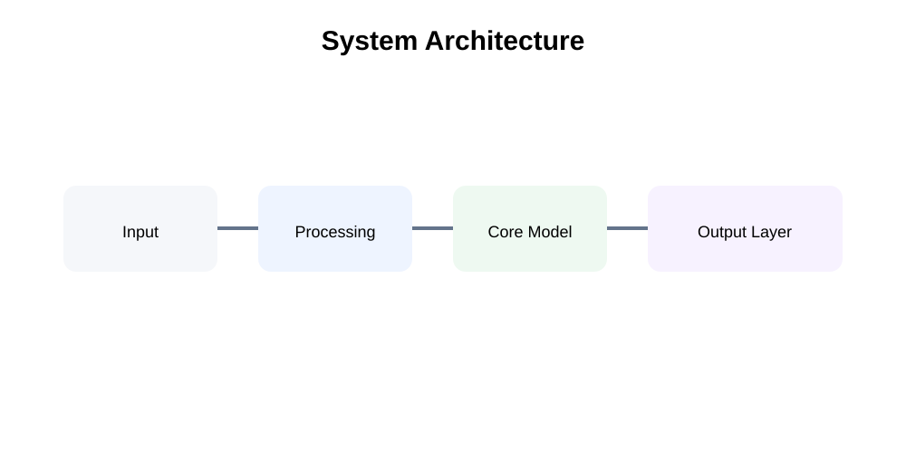
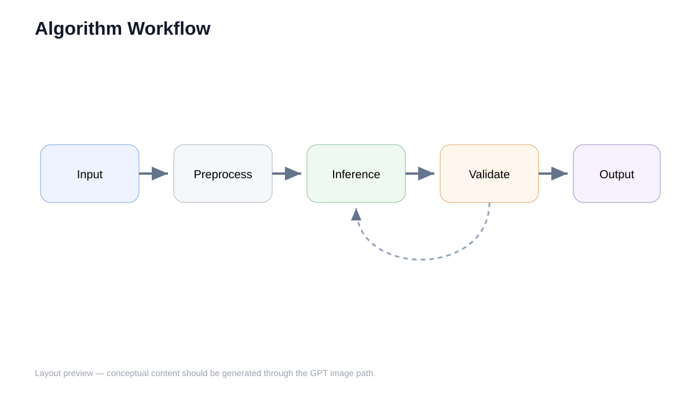
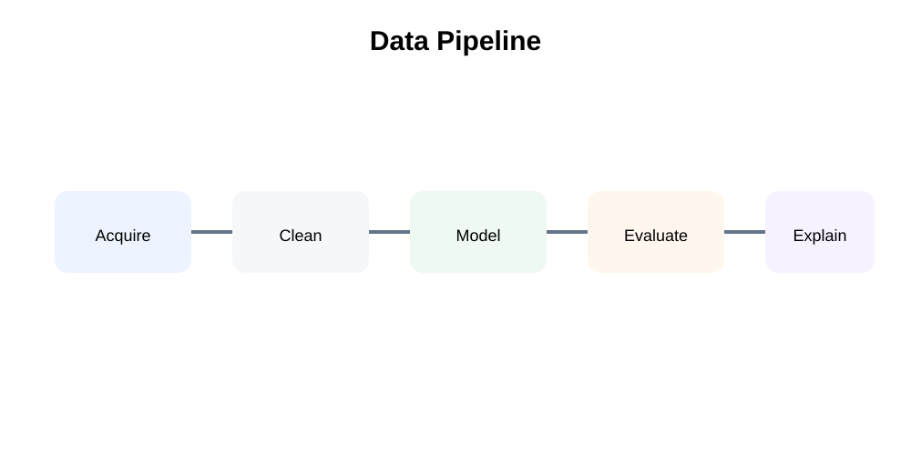
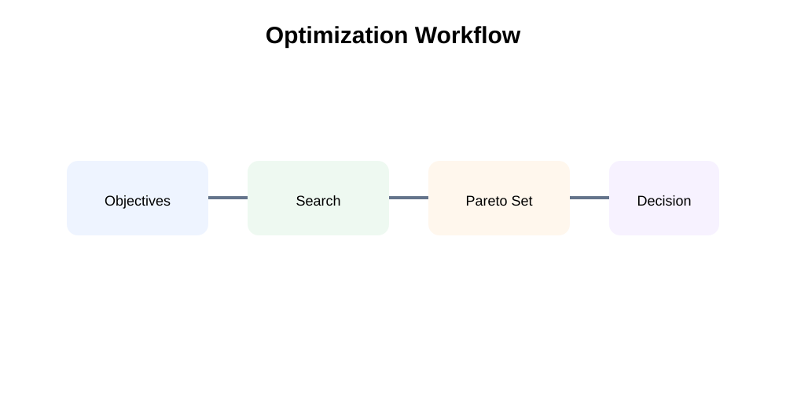

# Showcase

Engineering Figure GPT separates **real reproducible evidence** from **conceptual layout previews**.

## Reproducible exact outputs

These examples preserve the full Plot Request → normalized Plot Spec → vector output → verification chain. Their values are synthetic and illustrative, not scientific claims.

### Exact benchmark comparison


**Mode:** `plot`  
**Evidence:** [brief](examples/benchmark-exact/brief.md) · [request](examples/benchmark-exact/request.json) · [plot spec](examples/benchmark-exact/plot-spec.json) · [verification](examples/benchmark-exact/verification.md)

### Sensitivity / robustness analysis


**Mode:** `plot`  
**Evidence:** [brief](examples/sensitivity-robustness/brief.md) · [request](examples/sensitivity-robustness/request.json) · [plot spec](examples/sensitivity-robustness/plot-spec.json) · [verification](examples/sensitivity-robustness/verification.md)

The numeric semantics of these cases are deterministic. Re-rendering with a different Matplotlib version may change SVG coordinates or metadata, but it must not alter the preserved values.

---

## Real conceptual-output queue

Four concept cases are now prepared with a **Figure Brief + final prompt** and are waiting only for a real GPT Image run:

- [Chinese mathematical-modeling framework](showcase-plans/zh-mathematical-modeling-framework/brief.md)
- [RAG system architecture](showcase-plans/rag-system-architecture/brief.md)
- [Genetic-algorithm workflow](showcase-plans/genetic-algorithm-workflow/brief.md)
- [Multi-source fusion graphical abstract](showcase-plans/multisource-fusion-graphical-abstract/brief.md)

See the [Real Conceptual Showcase Queue](showcase-plans/README.md) for official OpenAI / trusted-relay run commands, verification, and packaging instructions.

These plan directories deliberately contain **no `output.png` and no completed `manifest.json`**. CI enforces that rule so an ungenerated plan cannot be mistaken for real showcase evidence.

---

## Conceptual capability previews

The following SVGs are **layout previews only**. They are deliberately kept separate from the reproducible examples above and are not claims that a particular GPT run produced them.

### Mathematical modeling framework


**Mode:** `image`  
**Goal:** summarize a modeling paper from problem definition through validation and decision output.  
**Source brief:** `../examples/mathematical-model-framework.md`

### AI system architecture



**Mode:** `image`  
**Suggested structure:** source data → preprocessing → core model → output layer.

### Algorithm workflow



**Mode:** `image`  
**Suggested structure:** input → preprocessing → inference / optimization → validation → output, with explicit loops and stop conditions when needed.  
**Source brief:** `../examples/algorithm-workflow.md`

### Data-analysis pipeline



**Mode:** `image` or `mixed`  
**Suggested structure:** acquisition → cleaning → modeling → evaluation → interpretation.

### Multi-objective optimization workflow



**Mode:** `image`  
**Suggested structure:** objectives + constraints → search / solver → Pareto set → final decision.

## Real conceptual-output milestone

A conceptual example moves out of "preview" status only after the repository contains:

```text
brief.md
prompt.txt
output.png
verification.md
manifest.json
```

If later manual editing is expected, also preserve `editable-handoff.md`.

The final remaining showcase milestone is therefore **real GPT conceptual output**, not more hand-drawn SVG previews.
